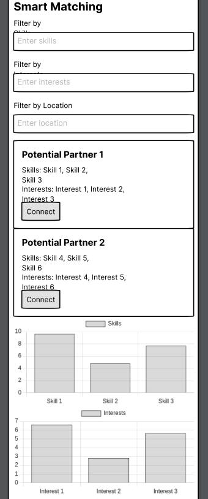
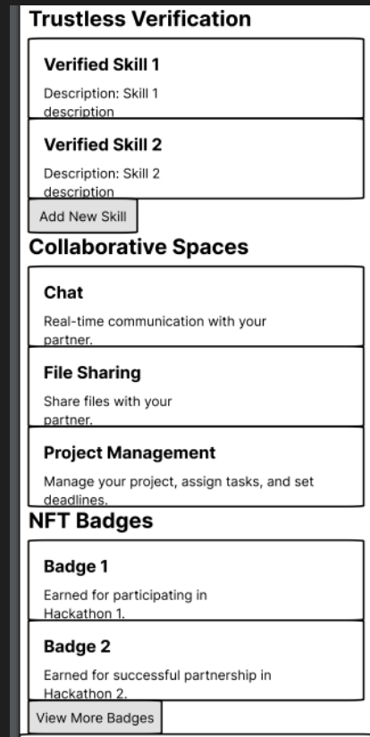

# Hackathon Partner Finder

<p align="center">
  
  
  
</p>

Hackathon Partner Finder is a decentralized Web3 platform designed to help you find the perfect hackathon partner based on your shared interests, skills, and thought processes. By leveraging blockchain technology, we ensure that your data is secure and that the matchmaking process is transparent and fair.

## Features

- **Decentralized Profiles:** Create a profile that highlights your skills, interests, and previous hackathon experiences.
- **Smart Matching:** An AI-powered algorithm matches you with potential partners who share similar interests and thinking styles.
- **Trustless Verification:** Verify your skills and experiences using decentralized attestations, ensuring authenticity and transparency.
- **Collaborative Spaces:** Once matched, connect with your partner in a dedicated, decentralized workspace where you can brainstorm ideas and start building your project.
- **NFT Badges:** Earn unique NFT badges for participating in hackathons and for successful partnerships.

## Getting Started

To get started with Hackathon Partner Finder:


[](http://perso.crans.org/besson/LICENSE.html)

### [Documentation](https://docs.turboeth.xyz)

# Getting Started

The `pnpm` CLI is the recommended package manager but `npm` and `yarn` should work too.

```bash
pnpm install
